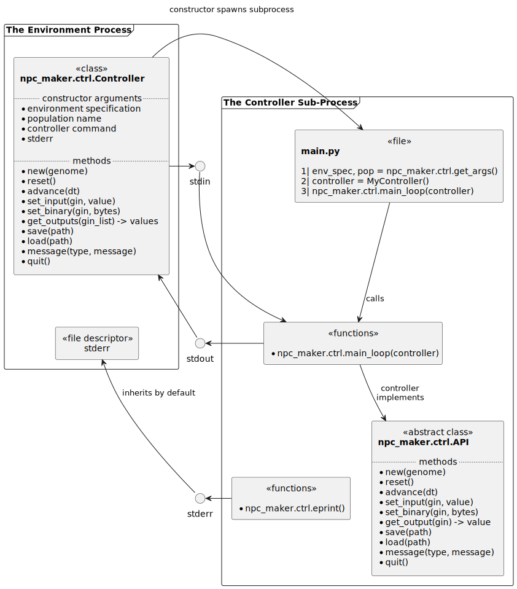

# The Controller Interface #

This chapter describes the interface between the environments and the control
systems for the agents inside of them. The interface is designed to be flexible
and error-tolerant. Users can implement custom control systems using this
interface. Implementations of the controller interface are referred to
as "**controllers**". Each controller is its own distinct computer program,
which executes in its own computer process and communicates with the
environment over its standard I/O channels in plain text.

## Command Line Invocation ##

Controller programs are totally specified by their command line invocation. Both
the program name and its arguments are considered part of the controller's
identity. The evolution service provides the command line invocation to the
environment, which should simply invoke it in a subprocess or at a shell.

## Standard Input Channel ##

The environment sends the controller commands and data over its standard input
channel. Messages are plain text encoded in UTF-8. Each message is one line
long. The first character of the line encodes the message type and should be
split off. The remainder of the line is the message body. Messages should be
acted upon in the order that they are received. The following table summarizes
the message types. The parts of the message format that are written in
`[ALL_CAPS_AND_BRACKETS]` are placeholders for runtime data.

In all messages the `[GIN]` argument is a non-negative integer which identifies
a sensor or motor interface. The interfaces are described in the environment
specifications.

|  Message Type | Message Format | Arguments | Description |
| :------------ | :------------- | :-------- | ----------- |
| Environment | `E[ENV_SPEC]\n` | `[ENV_SPEC]` is the filesystem path of the environment specification file | This message is always sent exactly once at the controller's startup, before any other messages |
| Population | `P[POPULATION]\n` | `[POPULATION]` is a name and a key into the environment specification's "populations" table | This message is always sent exactly once at the controller's startup, before any other messages |
| Genome | `G[GENOME]\n` | `[GENOME]` are the parameters for the new controller. The genome is a UTF-8 string, occupying a single line | Discard the current model and load a new one |
| Reset | `R\n` |  | Reset the currently loaded model to it's initial state |
| Advance | `X[DT]\n` | `[DT]` is the time period to advance over, measured in seconds |  |
| Set Input | `I[GIN]:[VALUE]\n` | `[GIN]` references a sensory input interface. `[VALUE]` is a UTF-8 string | Send data from the environment to the controller |
| Set Binary Input   | `B[GIN]:[NUM]\n` `[BYTES]` | `[GIN]` references a binary sensory input interface. `[BYTES]` is a byte array of length `[NUM]`. It must be read in binary mode | Send an array of bytes from the environment to the controller |
| Get Output | `O[GIN]\n` | `[GIN]` references a motor output interface | Request for the controller to send an output to the environment |
| Save | `S[PATH]\n` | `[PATH]` is the filesystem path to save to. If the file already exists then overwrite it. The parent directory will always exist | Save the current state of the controller to file |
| Load | `L[PATH]\n` | `[PATH]` is the filesystem path to load from | Load the state of the controller from file |
| Custom Message | `[TYPE][MESSAGE]\n` | `[TYPE]` is a single capital letter, which is not already in use by the protocol. `[MESSAGE]` may be any UTF-8 string | Send a custom message to the controller using a new message type |
| Quit | `Q\n` |  | Stop running the controller process. Exit as soon as possible |

## Standard Output Channel ##

The controller sends output values to the environment over its standard output
channel. Output values should only be sent in response to a request for them.
Each output message is a single line of UTF-8 text, beginning with the GIN of
the output, a separating colon, and followed the output value until the next
newline character "`\n`".

|  Message Type | Message Format | Arguments |
| :------------ | :------------- | :-------- |
| Send Output   | `[GIN]:[VALUE]\n` | `[GIN]` references a requested motor output interface. `[VALUE]` is a UTF-8 string |

## Standard Error Channel ##

The standard error channel is for unformatted diagnostic and error messages.
By default controllers inherit their `stderr` channel from their environment.

In the event that any of the three standard I/O channels closes or emits an error,
then all parties should assume that the controller program is dead and act accordingly.

## Schematic Diagram of the Controller Interface ##

