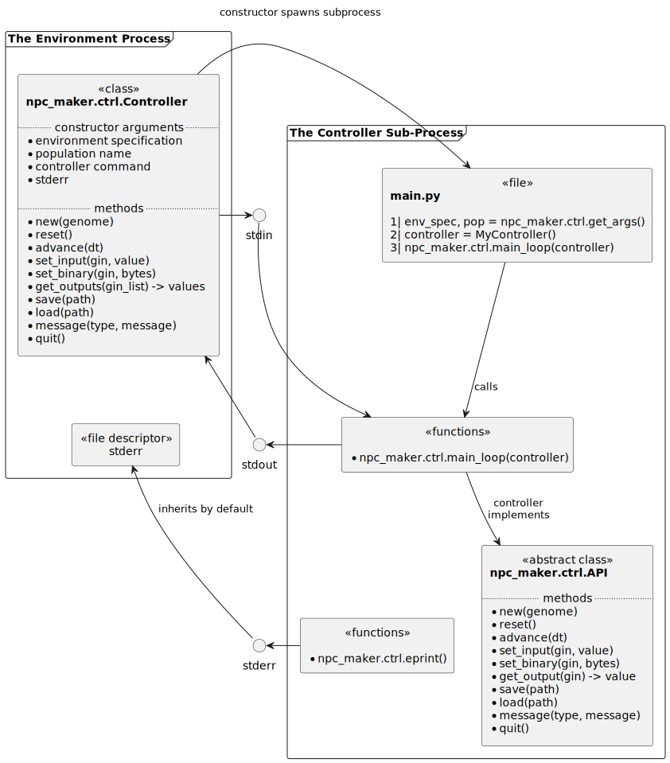

# The Controller Interface #

This document describes the interface between environments and control systems.
Users can implement custom environments and control systems using this interface.
The interface is designed to be error-tolerant, flexible and to facilitate
interoperability between software modules which were developed in isolation.

Each control system is its own distinct computer program. Each executes in its
own computer process and communicates over its standard I/O channels in plain text.

## Command Line Invocation ##

Controller programs are totally specified by their command line invocation. Both
the program name and its arguments are considered part of the controller's
identity. The main program provides the command line to the environment, which
should simply invoke it in a subprocess or at a shell.

## Standard Input Channel ##

The environment sends the controller commands and data over its standard input
channel. Messages are plain text encoded in UTF-8. Each message is one line
long. The first character of the line encodes the message type and should be
split off. The remainder of the line is the message body. Messages should be
acted upon in the order that they are received. The following table summarizes
the message types:

|  Message Type      | Message Format |
| :------------      | :------------- |
| Environment        | `E[ENV_SPEC]\n` |
| Population         | `P[POPULATION]\n` |
| New Controller     | `N[GENOTYPE]\n` |
| Reset Controller   | `R\n` |
| Advance Controller | `X[DT]\n` |
| Set Input          | `I[GIN]:[VALUE]\n` |
| Set Binary Input   | `B[GIN]:[NUM_BYTES]\n[DATA]` |
| Get Output         | `O[GIN]\n` |
| Save Controller    | `S[PATH]\n` |
| Load Controller    | `L[PATH]\n` |
| Quit               | `Q\n` |

* Environment.  
This message is always sent exactly once at the controller's startup, before any other messages.  
The message body is the file path of the environment specification file.  

* Population.  
This message is always sent exactly once at the controller's startup, before any other messages.  
The message body is a name and a key into the environment spec's "populations" table.  

* New Controller.  
Discard the current model and load a new one.
The message body is the genome for the new control system.
The genome is a JSON object.

* Reset Controller.  
Reset the currently loaded model to it's initial state.

* Advance Controller.  
The message body is the time period to advance over, measured in seconds.

* Set Input.  
Send data from the environment to the controller.
The value may be any UTF-8 string, and is terminated by the next newline.
The environments and controllers may interpret the value as they wish.

* Set Binary Input.  
Send a byte array from the environment to the controller.  
  + To read binary data in python use: `sys.stdin.buffer.read(num_bytes)`
  + To write binary data in python use: `sys.stdout.buffer.write(bytes)`

* Get Output.  
Request for the controller to send an output to the environment.

* Save.  
Save the current state of the controller to file.
The message body is the file path to save to.

* Load.  
Load the state of the controller from file.
The message body is the file path to load from.

* Quit.  
Stop running the controller process.

## Standard Output Channel ##

The controller sends output values to the environment over its standard output
channel. Output values should only be sent in response to a request for them.
Each output value message is a single line of UTF-8 text, starting with the GIN
of the output and ending after the next new line.

Message Format: `[GIN]:[VALUE]\n`

## Standard Error Channel ##

All messages written to stderr may be assumed to be fatal errors.  
The environment should forward all such errors via its own stderr channel.  

In the event that any of the three standard I/O channels close or emit an error,
then all parties should assume that the controller is dead and act accordingly.

## Schematic Diagram ##

