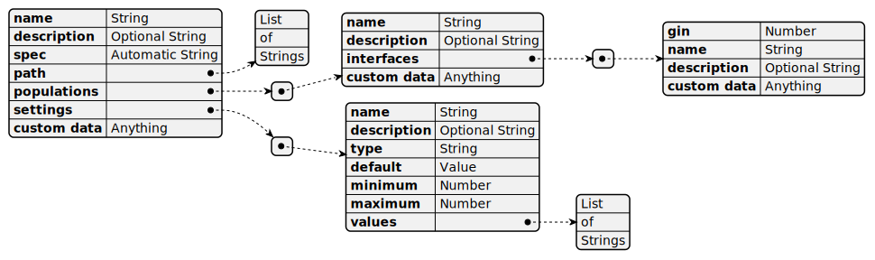
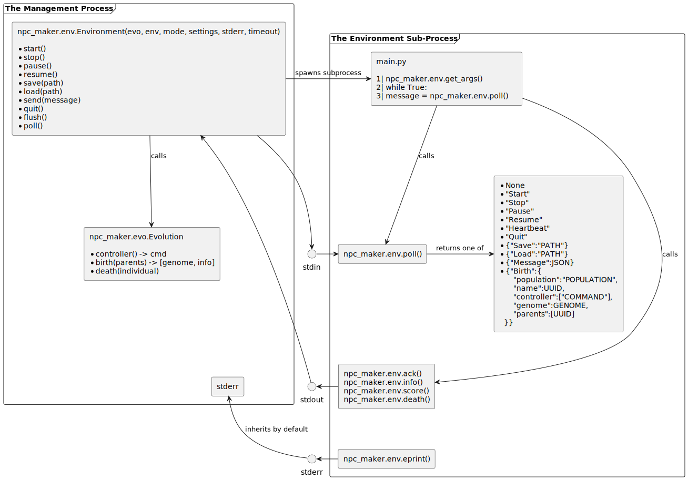

# The Environment Interface #

This document describes the interface between management programs and environments.
The NPC Maker should be capable of interacting with almost any simulated environment.
The word "**environment**" refers to a self contained simulated world and
everything in it, including all of the living bodies and their control systems. 
The NPC Maker defines a standard interface for interacting with arbitrary
environments. Users are encouraged to add their own environments.

Environments have two parts: a static description and an executable program.
The static description contains all of the information needed to configure and
run the environment. The executable program does the actual work of setting up
and running the environment.

Environments always execute in a different computer process than the main
program of the NPC Maker framework, which is referred to as the management
program. This separation has many advantages. It allows the NPC Maker to
tolerate unreliable environments and recover from environment crashes. This
design also allows the environment to be implemented independently of the main
program. The user can create their own environments written in the programming
language of their choice. Finally, this design allows multiple instances of the
environment to run concurrently and on multiple computers.

## Environment Specification ##

The environment specification is a JSON file encoded with UTF-8. Each file
describes a single distinct and self contained environment. The JSON file
contains a single JSON object. The following table shows all of the expected
attributes of the object. 

| Attribute | JSON Type | Default Value | Description |
| :-------- | :-------: | :------------ | :---------- |
| `"name"`   | String | Required | Name of the environment, should be globally unique |
| `"path"`   | String | Required | Filesystem path of the environment's executable program, relative to this file |
| `"spec"`   | String | Automatic | Filesystem path of the environment specification (this file) |
| `"populations"` | Array of Populations | `[]` | Specification for each population |
| `"settings"` | Array of Settings | `[]` | Settings menu items for the user to customize the environment |
| `"description"` | String | `""` | User facing documentation message |

Extra attributes are simply ignored and so you can store miscellaneous data in
this file. This file is given to the environment program as a command line
argument, which allows one program to be reconfigured to implement multiple
different environments.

The "**path**" attribute specifies the environment program. It may be either its
filesystem path as a string, or its complete command line invocation as an
array of strings where the first string is the program's path and the remaining
strings are its command line arguments.

The "**populations**" attribute is an array of population specification objects.
Environments can have multiple populations of simultaneously evolving
lifeforms. The following table shows all of the expected attributes of the
population objects. Extra attributes are simply ignored, and authors are
encouraged to include extra information about the population.

| Attribute | JSON Type | Default Value | Description |
| :-------- | :-------: | :------------ | :---------- |
| `"name"` | String | Required | Name of the population, must be unique within the environment |
| `"description"` | String | `""` | User facing documentation message |
| `"interfaces"` | Array of Interfaces | `[]` | Genetic interface for this lifeform's body |

The "**interfaces**" attribute is an array of interface specification objects,
which describe the interface between a body type and its genotype. Each
interface object contains a single chromosome, identified by both its global
innovation number and its externally visible name. The following table shows
all of the expected attributes of interface objects. Again, extra attributes
are simply ignored.

| Attribute | JSON Type | Default Value | Description |
| :-------- | :-------: | :------------ | :---------- |
| `"gin"` | String | Required | Global Innovation Number, must be unique within the interfaces array |
| `"name"` | String | Required | User facing name for this chromosome, must be unique within interfaces array |
| `"description"` | String | `""` | User facing documentation message |

The environment specification's "**settings**" attribute describes miscellaneous
environmental parameters which are presented in the graphical user interface in
a settings menu for this environment. The user is free to modify these
settings, but only before starting the evolutionary algorithm and environment.
The following table shows all of the expected attributes of settings objects,
and extra attributes are *not* allowed.

| Attribute | JSON Type | Default Value | Description |
| :-------- | :-------: | :------------ | :---------- |
| `"name"`        | String | Required | Name of this settings menu item, must be unique within the environment |
| `"description"` | String | `""`     | User facing documentation message |
| `"type"` | String | Required | Data type |
| `"default"` | -- | Required | Initial value for new environments |
| `"minimum"` | Number | Required for Real and Integer types | Lower bound on the range of allowable values, inclusive |
| `"maximum"` | Number | Required for Real and Integer types | Upper bound on the range of allowable values, inclusive |
| `"values"`  | Array of Strings | Required for Enumeration type | Names of all of the variants of the enumeration |

The setting's "**type**" attribute must be one of the following strings or abbreviated aliases:

| Setting Type    | Abbreviation |
| :-----------    | :----------- |
| `"Real"`        | `"float"`    |
| `"Integer"`     | `"int"`      |
| `"Boolean"`     | `"bool"`     |
| `"Enumeration"` | `"enum"`     |

### Schematic Diagram ###

## Environment Program ##

Environments are implemented as stand-alone programs.  
They are called with the following command line arguments:

0) The name of the program being executed.  
   This is a standard argument for all computer programs.  

1) The filesystem path of the environment specification.

2) Either the word "graphical" or the word "headless" to indicate whether or not
the environment should show graphical output to the user. This is useful for
diagnostic and demonstration purposes.

3) The user's settings, as a list of `name` `value` pairs. The settings are
described in the "settings" attribute of the environment specification.

## Environment Protocol ##

Environments are implemented as distinct programs that interact with the
management program using the environment protocol. Communication happens over
the environment's `stdin`, `stdout` and `stderr` file descriptors. The protocol
uses simple human readable text messages and is designed to be easy to parse
and forgiving of implementation errors. The protocol consists of JSON messages
encoded with UTF-8. Each message occupies exactly one line of text and is
terminated by the newline character `\n`. In the event of unrecognized or
invalid messages, all parties should attempt to recover and resume normal
operation.

Normally messages are sent over the `stdin` and `stdout` channels. The `stderr`
channel is reserved for communicating errors from the environment program to
the management program. The `stderr` channel has no specific message format or
protocol. All data written to `stderr` is saved to file for debugging purposes.
The graphical user interface displays a warning indicator for every instance of
the environment program that has written to `stderr`. Instances that write to
`stderr` are allowed to continue operating as normal, provided that they
continue to respond to the regular heartbeat messages.

### Program Control Messages ###

The management program wants to control the state of execution of its
environment programs. The following table shows all of the commands that the
management program may send to the environment and the appropriate response for
each command. The environment should send an "Ack" response only after it
successfully completes the given command. In case multiple conflicting commands
are received before the environment is able to service them, only the most
recent command should be performed and acknowledged. If for any reason the
environment needs to change into a state that was not commanded, then it should
send the corresponding "Ack" response unprompted to inform the management program.

| Message | Sender | Receiver | Description |
| :------ | :----: | :------: | :---------- |
| Start | Management | Environment | Request for the environment to start running |
| Stop  | Management | Environment | Request for the environment to finish all work in progress. The environment may continue sending messages to the Management, but it will not be given any new individuals to evaluate |
| Pause | Management | Environment | Request that the environment temporarily pause, with the expectation that it will later be resumed. The environment should immediately cease any computationally expensive activities, though it should retain all allocated memory |
| Resume | Management | Environment | Request for the environment to resume after a temporary pause |
| Heartbeat | Management | Environment | The NPC Maker uses a watchdog timer system to manage unreliable environments. Heartbeat messages must be must acknowledge or else the environment will time out |
| Save | Management | Environment | Save the current state of the environment to the given filesystem path, including the internal states of all control systems. Note that when the environment is reloaded in-flight messages might not be replayed |
| Load | Management | Environment | Discard the current state of the environment and load a previously saved state from the given filesystem path |
| Quit | Management | Environment | Demand the environment shut down and exit as fast as possible. Do not finish any work in progress and do not save any data. The environment will not be resumed. Further messages sent to management will be ignored |
| Ack | Environment | Management | Signal that the environment is now in the given state, or that the given command has been completed |
| Message | Management | Environment | Send a user defined message to the environment |

Environments should start in the "Stop" state.

The "Save" path may already exist, in which case the environment should simply
overwrite the old file. The parent directory of the save file will always exist.
The environment should never create a directory; if multiple files are needed
then they should be zipped together.

Environments should implement the "Save" and "Load" commands if they are long
running or if they support survival-based evolution. When performing
survival-based evolution the individuals should persist across save/load
points, otherwise their internal state will be lost. The "Stop" command is
never called during survival-based evolution because it normally causes all
living individuals to die off without being replaced, which would cause the
population to go extinct. Instead the environment will save and quit.

### Evolution Messages ###

The environment program must request new individuals when it is ready to
evaluate them. New individuals are not usually sent unsolicited. The NPC Maker
framework will always service these requests in the order that they are received.
The following table shows all of the messages related to managing individuals.

| Message   |   Sender    | Receiver  | Description |
| :------   |   :----:    | :------:  | :---------- |
| New   | Environment | Management | Request a new individual from the evolutionary algorithm |
| Mate  | Environment | Management | Request to mate two individuals. Both individuals must be alive, in this environment, and of the same population |
| Birth | Management | Environment | Give a new individual to the environment |
| Score | Environment | Management | Report the score or reproductive fitness of a living individual |
| Info  | Environment | Management | Associate some extra information with a living individual. The data is kept alongside the individual in perpetuity and is displayed to the user |
| Death | Environment | Management | Report the death of an individual |

Birth messages do not need to be acknowledged.

Birth messages contain the following information about the individual:
* `"name"` a string, a UUID for future reference
* `"population"` the name of this individual's population
* `"controller"` a list of strings, its control system's command line invocation
* `"genome"` a JSON object
* `"parents"` a list of UUIDs, empty if created by a "New" request

### Message Format ###

Each message occupies exactly one line, and is encoded in the UTF-8 JSON format.  
Values in ALL-CAPS are placeholders for runtime data.  

| Message Format |
| :------------- |
| `{"Ack":MESSAGE}` |
| `{"Birth":{"population":"POPULATION","name":UUID,"controller":["COMMAND"],"genome":GENOME,"parents":[UUID]}}` |
| `{"Death":UUID}` |
| `"Heartbeat"` |
| `{"Info":{"KEY":"VALUE"},"name":UUID}` |
| `{"Load":"PATH"}` |
| `{"Mate":[PARENTS]}` |
| `{"Message":JSON}` |
| `{"New":"POPULATION"}` |
| `"Pause"` |
| `"Quit"` |
| `"Resume"` |
| `{"Save":"PATH"}` |
| `{"Score":NUMBER,"name":UUID}` |
| `"Start"` |
| `"Stop"` |

### Schematic Diagram ###

