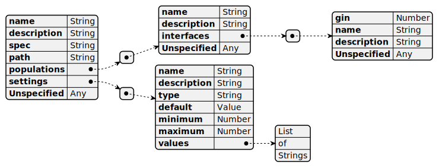

# The Environment Interface #

This chapter describes the interface between management programs and environments.
The NPC Maker is capable of interacting with almost any simulated environment.
The word "**environment**" refers to a self contained simulated world and
everything in it, including all of the living bodies and their control systems. 
The NPC Maker defines a standard interface for interacting with arbitrary
environments. Users are encouraged to add their own environments.

Environments have two parts: a static description and an executable program.
The static description contains all of the information needed to configure and
run the environment. The executable program does the actual work of setting up
and running the environment.

Environments always execute in a different computer process than the main
program of the NPC Maker framework, which is referred to as
the "**management**" program. This separation has many advantages. It allows
the NPC Maker to tolerate unreliable environments and recover from environment
crashes. This design also allows the environment to be implemented
independently of the management program. The user can create their own
environments written in the programming language of their choice. Finally, this
design allows multiple instances of the environment to run concurrently and on
multiple computers.

## Environment Specification ##

The environment specification totally describes a single distinct and self
contained environment. It is a JSON file encoded in UTF-8. It should use
the ".env" file extension although this is not required. The file contains a
single JSON object. The following table shows all of the expected attributes of
the object. 

| Attribute | JSON Type | Default Value | Description |
| :-------- | :-------: | :------------ | :---------- |
| `"name"`   | String | Required | Name of the environment, should be globally unique |
| `"path"`   | String | Required | Filesystem path of the environment's executable program, relative to this file |
| `"spec"`   | String | Automatic | Filesystem path of the environment specification (this file) |
| `"populations"` | Array of Populations | `[]` | Specification for each population |
| `"settings"` | Array of Settings | `[]` | Settings menu items for customizing the environment |
| `"description"` | String | `""` | User facing documentation message |
| Unspecified | Any |  | Environments may include extra information |

Extra attributes are simply ignored and so you can store miscellaneous data in
this file. This file is given to the environment program as a command line
argument, which allows one environment program to be reconfigured for multiple
different scenarios.

The "**populations**" attribute is an array of population specification objects.
Environments can have multiple populations of simultaneously evolving
lifeforms. The following table shows all of the expected attributes of the
population objects. Extra attributes are simply ignored, and authors are
encouraged to include extra information about the population.

| Attribute | JSON Type | Default Value | Description |
| :-------- | :-------: | :------------ | :---------- |
| `"name"` | String | Required | Name of the population, must be unique within the environment |
| `"description"` | String | `""` | User facing documentation message |
| `"interfaces"` | Array of Interfaces | `[]` | Genetic interface for this agent's body |
| Unspecified | Any |  | Environments may include extra information about this population |

The "**interfaces**" are the connections between an agent's body
and its control system. The interfaces attribute is an array of objects which
each describe a single sensory input or motor output. Each interface has two
unique identifiers: the global innovation number identifies the interface
within the genome, and a user facing name identifies the interface within the
environment. The following table shows all of the expected attributes of
interface objects. Again, extra attributes are simply ignored.

| Attribute | JSON Type | Default Value | Description |
| :-------- | :-------: | :------------ | :---------- |
| `"gin"` | Number | Required | Global Innovation Number, must be unique within the interfaces array |
| `"name"` | String | Required | User facing name for this port, must be unique within this interfaces array |
| `"description"` | String | `""` | User facing documentation message |
| Unspecified | Any |  | Environments may include extra information about this interface |

The environment specification's "**settings**" attribute describes the command
line arguments of the environment program. The user must finalize their
settings before starting the environment program. The settings are presented to
the user in the help menu for each environment. The following table shows all
of the expected attributes of settings objects, and extra attributes are *not*
allowed.

| Attribute | JSON Type | Default Value | Description |
| :-------- | :-------: | :------------ | :---------- |
| `"name"`        | String | Required | Name of this settings menu item, must be unique within the environment |
| `"description"` | String | `""`     | User facing documentation message |
| `"type"` | String | Required | Data type of this settings item |
| `"default"` |  | Required | Value to use if this setting is missing |
| `"minimum"` | Number | Required for Real and Integer types | Lower bound on the range of allowable values, inclusive |
| `"maximum"` | Number | Required for Real and Integer types | Upper bound on the range of allowable values, inclusive |
| `"values"`  | Array of Strings | Required for Enumeration type | Names of all of the variants of the enumeration |

The setting's "**type**" attribute must be one of the following strings or abbreviated aliases:

| Data Type       | Abbreviation |
| :--------       | :----------- |
| `"Real"`        | `"float"`    |
| `"Integer"`     | `"int"`      |
| `"Boolean"`     | `"bool"`     |
| `"Enumeration"` | `"enum"`     |

### Schematic Diagram of the Environment Specification ###

## Environment Program ##

Environments are implemented as stand-alone programs.  
They are called with the following command line arguments:

0) The name of the program being executed.  
   This is a standard argument for all computer programs.  

1) The filesystem path of the environment specification.

2) Either the word "graphical" or the word "headless" to indicate whether or not
the environment should show graphical output to the user. This is useful for
diagnostic and demonstration purposes.

3) The remaining arguments are the user's settings, as `name` `value` pairs.
These are described in the "settings" attribute of the environment
specification.
   * The settings may be in any order. 
   * Missing settings are filled in with their default values. 
   * Unexpected settings may be rejected. 

## Environment Protocol ##

Environments are implemented as distinct programs that interact with the
management program using the environment protocol. Communication happens over
the environment's `stdin`, `stdout` and `stderr` file descriptors. The protocol
uses simple human readable text messages and is designed to be easy to parse
and forgiving of implementation errors. The protocol consists of JSON messages
encoded with UTF-8. Each message occupies exactly one line of text and is
terminated by the newline character "`\n`". In the event of unrecognized or
invalid messages, all parties should attempt to recover and resume normal
operation.

Normally messages are sent over the `stdin` and `stdout` channels. The `stderr`
channel is reserved for communicating errors and diagnostic information from
the environment program to the management program. The `stderr` channel has no
specific message format or protocol. By default environments inherit their
`stderr` channel from the management program.

### Program Control Messages ###

The management program wants to control the state of execution of its
environment programs. The following table summarizes all of the commands that
the management program may send to the environment and the appropriate response
for each command. The environment should send an "Ack" response only after it
successfully completes the given command. In case multiple conflicting commands
are received before the environment is able to service them, only the most
recent command should be performed and acknowledged. If for any reason the
environment needs to change into a state that was not commanded, then it should
send the corresponding "Ack" response unprompted to inform the management program.

| Message Type | Sender | Receiver | Description |
| :----------- | :----: | :------: | :---------- |
| Start | Management | Environment | Ask the environment to start running |
| Stop  | Management | Environment | Ask the environment to finish all work in progress, but to avoid beginning new work.  The environment may later be restarted |
| Pause | Management | Environment | Ask the environment to temporarily pause, with the expectation that it will later be resumed. The environment should *immediately* cease all computationally expensive activities, though it should retain all allocated memory |
| Resume | Management | Environment | Ask the environment to resume after a temporary pause |
| Heartbeat | Management | Environment | The NPC Maker uses watchdog timers to manage unreliable environments. Heartbeat messages must be must acknowledge or else the environment will be considered timed out |
| Save | Management | Environment | Save the current state of the environment to the given filesystem path, including the internal states of all control systems. Note that when the environment is reloaded in-flight messages might not be replayed |
| Load | Management | Environment | Discard the current state of the environment and load a previously saved state from the given filesystem path |
| Quit | Management | Environment | Demand the environment shut down and exit as fast as possible. Do not finish any work in progress and do not save any data. The environment will not be resumed. Further messages sent to management will be ignored |
| Ack | Environment | Management | Signal that the environment is now in the given state, or that the given command has been completed |
| Message | Management | Environment | Send a user defined message to the environment |

Environment programs should initialize to the "Stopped" state.

The "Save" path may already exist, in which case the environment should simply
overwrite the old file. The parent directory of the save file will always exist.
The environment should never create a directory; if multiple files are needed
then they should be zipped together into a single archive file.

### Evolution Messages ###

The environment program must request new individuals when it is ready to birth
and evaluate them. New individuals will not be sent unsolicited. The NPC Maker
framework will always service these requests in the order that they are
received. These messages should not be acknowledged. The following table
summarizes all of the messages related to managing individuals.

| Message Type | Sender | Receiver | Description |
| :----------- | :----: | :------: | :---------- |
| New   | Environment | Management | Request a new individual from the evolutionary algorithm |
| Mate  | Environment | Management | Request a new individual by mating individuals together. This requires at least one parent. This accepts more than two parents. All parents must be alive, in this environment, and of the same population |
| Birth | Management | Environment | Send a new individual to the environment for immediate birth and subsequent evaluation. Birth messages should not be acknowledged |
| Score | Environment | Management | Report the score or reproductive fitness of a living individual |
| Info  | Environment | Management | Associate some extra information with a living individual. The info is kept alongside the individual in perpetuity |
| Death | Environment | Management | Report the death of an individual |

"**Birth**" messages contain the following information about the new individual:

| Attribute | JSON Type | Description |
| :-------- | :-------: | :---------- |
| `"name"`        | String | Each individual is assigned a UUID for future reference |
| `"parents"`     | List of Strings | The UUIDs of the parents. May be empty, especially if created by a "New" request |
| `"environment"` | String | Name of the environment that the individual is being born into |
| `"population"`  | String | Name of the population that this individual belongs to  |
| `"controller"`  | List of Strings | Command line invocation of the controller program |
| `"genome"`   | Anything | Genetic parameters for the new controller |

### Message Format ###

Each message occupies exactly one line, and is encoded in the UTF-8 JSON format.  
Words in ALL-CAPS are placeholders for runtime data.  

| Message Format |
| :------------- |
| `{"Ack":MESSAGE}\n` |
| `{"Birth":{"environment":"ENVIRONMENT","population":"POPULATION","name":"UUID","controller":["COMMAND"],"genome":GENOME,"parents":["UUID"]}}\n` |
| `{"Death":"UUID"}\n` |
| `"Heartbeat"\n` |
| `{"Info":{"KEY":"VALUE"},"name":"UUID"}\n` |
| `{"Load":"PATH"}\n` |
| `{"Mate":["UUID","UUID"]}\n` |
| `{"Message":JSON}\n` |
| `{"New":"POPULATION"}\n` |
| `"Pause"\n` |
| `"Quit"\n` |
| `"Resume"\n` |
| `{"Save":"PATH"}\n` |
| `{"Score":"VALUE","name":"UUID"}\n` |
| `"Start"\n` |
| `"Stop"\n` |

### Schematic Diagram of the Environment Interface ###

