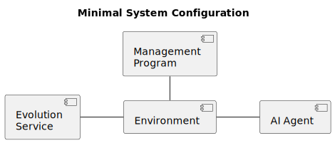
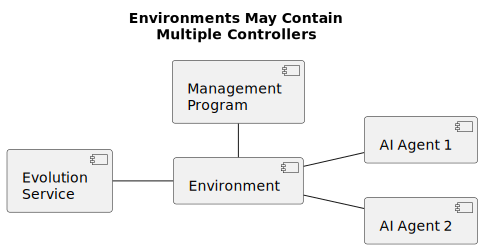
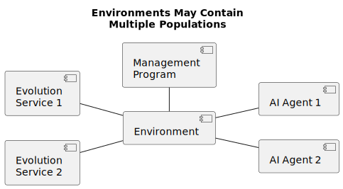
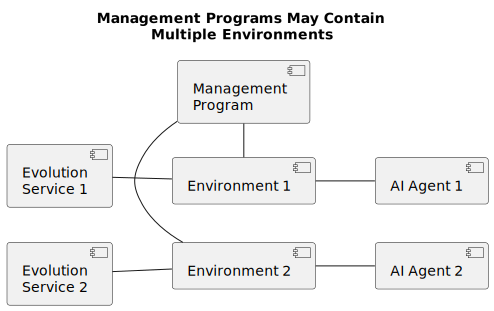
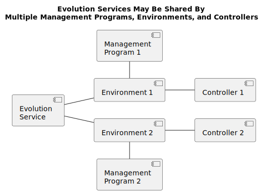

# The Management Program #

This document describes how to set up and run the NPC Maker framework.
The framework consists of many pieces which need to be gathered up, assembled
correctly, and set in motion. The management program is responsible for
creating and controlling instances of the environment, and for procuring
evolution services for the environment.

See the [examples](../examples/) directory for practical guidance on using the NPC Maker's APIs.

## Example System Configurations ##

There are many possible ways for you, the user, to set up your computer systems.  
Here are a few examples:

